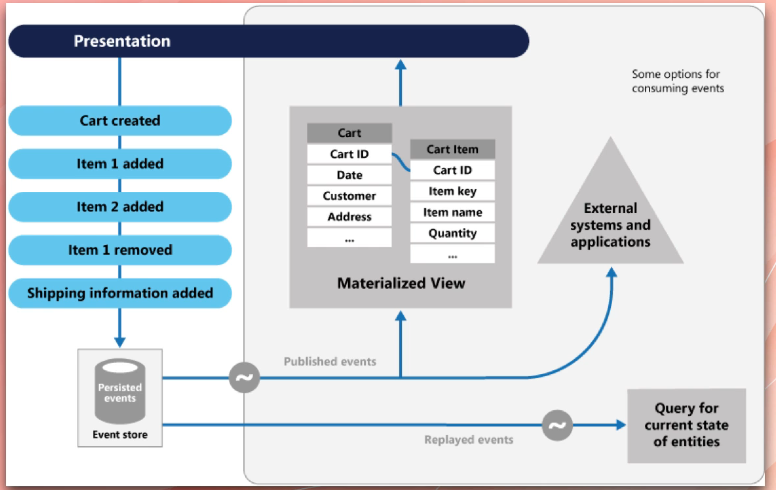
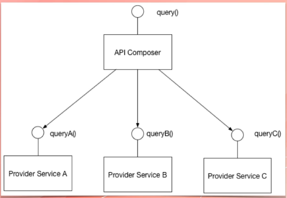

# Microservices Interview Questions

## What is coupling ?
- Dependency is an essential functionality, library,component,service or code that is essential for different software systems to work
- 
- Coupling is a degree of interdependence of software modules, services or components
- High Coupling: very high dependency, cannot replace one system without changing its dependencies also
- Aim in software design is low coupling

## Types of Coupling
- Content Coupling: One class can access private members of another class(not allowed in C# but allowed in C++ ) -->This increases coupling
- Common Coupling: Two classes access the same shared data: global data and static properties, In VB, we have global variables, in c# we have static properties
- Control Coupling: When a function controls the flow of another function
- Routine Coupling: When a function calls another function without passing any parameters (2 functions working on a shared field)
- Data Coupling: When 2 systems share the same database
- Type Use Coupling: When member or property of class B is of type Class A (if we replace A with something else, class B needs to be updated also)
- Stamp Coupling: When in Class B, a method has a parameter of type Class A
- Import Coupling: When a library is imported into another program i.e DLL files in Windows
- External Coupling: When communicating with an external program
- 
- Component A and Component B use SOAP API which communicates using XML. If the XML is changed, both Component A and B have to change. This represent high coupling
- Thats why we dont use SOAP APIs anymore, restful APIs have replaced that because there is no interdependence on that intermediate XMl

## What is Cohesion? Do we want High Cohesion or Low Cohesion?
- It is a degree to which elements of a module, software or code are related
- How well they work together to achieve a goal
- High cohesion is good
- 
- Better to have 3 different classes here one for DateToString, other for SmtpConfig and another for Logging Error
- High Cohesion and Low Coupling is good

## What are microservices
- It is an architectural style and organizational approach, where software is composed of small independent services that communicate with each other in a loosely coupled manner.
- 
- Addressed problems of monolithic application
- Monolithic applications have high coupling and low cohesion.
- Every process is an independent service in a microservice with its own memory and database and executes separately
- Microservices communicate in a loosely coupled manner

## Pros and Cons of Monolithic Application
- One github repository for monolithic application and deployed as a whole
- Monoliths are faster
- 
- Monoliths are good for small simple applications, but they dont scale well
- Also, it is a good idea to have different technology stacks as different technologies may be well suited for different applications

## Alternatives to Monolith Applications
- Component based Monolithic Applications (COM in Windows)
- Multiple binary files or DLLs
- All libraries, however, run as part of a single process and app
- Service Oriented Architecture (SOA) was another alternatives
- Services communication via SOAP or Restful HTTP APIs
- Normally same technology stack is used
- In SOA, services use a shared database
- SOA is deprecated
- Microservices is the latest improvement
- 

## Benefits of Microservices Architecture
- Can be deployed independently
- Change in one part, doesnt mean other parts need to be re-deployed
- Can be scaled independently
- Shopping Cart Services can have 10 instances versus 2 instances for Payment Service
- Better fault tolerance
- Concept of Blast Radius
- If a microservice fails, other services can continue working
- Allows team members learn the microservice code quicker and easily
- Support Different Technology Stacks
- Can communicate asynchronously by using event streaming like Apache Kafka
- 

## Drawbacks of Microservices
- Complex to design and build
- Requires changes in how teams and organizations work
- Need more teams to manage and more developers are required
- Teams have to collaborate more efficiently
- More expensive to build
- Diagnosing and Debugging Problems is more difficult: need to invest more in monitoring and tracing
- Testing is lot more challenging...some services are ready some are not ready also need to deal with more teams
- Not a one size fit all solution

## How microservices relate to business
- Business prefer to use cloud services like AWS as opposed to on-prem infrastructure to avoid large Capex
- Need to use Pay as you go model
- Microservices are cloud native
- Can deploy microservices as serverless functions or run in AKS
- Microservices enable business to better implement Agile
- Can outsource part of development effort and reduce time to market

## Anatomy of a Micro-service based system
- 
- Company network is divided into Public Subnet and Private Subnet
- We can have a Public API Gateway and Private API Gateway

## Design Patterns and tools used in developing microservices
- Event Streaming (Kafka)
- Message Brokers (ActiveMq, RabbitMq)
- Containers and Docker
- Kubernetes
- No-Sql Database
- Event Sourcing helps in reducing blast radius
- Restful API
- API Gateway

## Blast Radius
- Degree to which the entire system is affected if microservice fails or shuts down
- In monolithic application, blast radius is 100% (if db becomes unavailable or part of application encounters error)
- We can reduce blast radius with patterns of resilience
- We can have independent database for each service
- Have timeouts and handle it gracefully
- Backoff strategy(retries)
- Circuit Breaker Pattern
- Bulkhead Pattern
- Fallback pattern
- Asynchronous communication is preferred

## Circuit Breaker Pattern
- Applies to API(point to point) calls
- We set a threshold for failing API calls i.e 3
- If failing API exceeds threshold, we reject API calls
- Circuit Breakers are microservices themselves and act as Proxy
- Has 3 states: Open, Closed and Half-Open
- 
- 
- Half-Open half the requests are rejected, only half are allowed to go through
- Cannot have one centralized circuit breaker
- We can build circuit breaker within microservices itself
- In .NET Core WebAPI, we can introduce a check that if my CPU usage is too high or downstream microservice is sending errors, we can handle it gracefully inside it only

## Some ways of building microservices
- Single-Tenant Microservices: One microservice on one virtual server
- Containerized microservices: each service runs as a Docker container
- Serverless: AWS Lambda or Azure Functions
- Spring Boot in Java

## Difference between event and message
- Message is superclass
- Event and Command are subclasses of Message
- 
- Events are handled by Event Streaming like Apache Kafka
- Commands are handled by RabbitMq
- 

## Distributed Transaction
- In a microservice based architecture, each service has its own database
- We need to make sure CRUD transactions are atomic across all services
- Managing transactions across multiple services is distributed transactions
- In a monolithic application we have this:
- 
- 

### How Distributed Transactions are handled?
- 2 Patterns for handling distributed transactions
- 2 Phase Commit Transactions(2PC) not recommended
- Saga Pattern

## 2 Phase Commit Patterns(2PC)
- Widely used in databases
- Need coordinate microservice
- useful in microservices
- has a prepare phase and commit phase
- First, microservices are asked to prepare for change(Create a record in database and set its status field or column to 0)
- Microservices are asked to make the final and actual change
- After all updates, set the Status field to 1
- We need a coordinator microservice to maintain lifecycle of all the transactions
- 
- Failed 2-Phase  Commit
- 

## Saga Pattern for Distributed Transactions
- This pattern is an async way of managing distributed transactions
- In 2PC, we need to wait for microservice to send its data
- There is no waiting in Saga Pattern
- Each microservice handles its own transaction
- There are 2 sub-patterns
- Choreography Pattern: If something goes wrong, microservices have to tell the upstream microservices or previous microservices to Rollback the transaction
- Orchestration Pattern: A central microservice delivers the messages for the rollbacks
- Both of these patterns can be used to manage business workflows

## Choreography Pattern
- 
- If something goes wrong, this is what will happen
- 
- In choreography pattern there is no orchestrator in-between, they have to do all management by themselves

## Orchestration Pattern
- 
- We have a saga orchestrator in-between
- Orchestrator catches all messages from the services and then sends messages for rollbacks
- Apache Kafka is best used
- We can use RabbitMq

## Difference between Monolithic, SOA and Microservices
- 

## What is Bounded Context ?
- Concept of Domain Driven Design
- DDD is a framework of analyzing and modeling large problems, models and teams
- The entire problem is a Domain: i.e a Drone Delivery System
- A domain model is a representation of a real thing in the world: Drone, User, Package
- A bounded context is a boundary within a domain where a particular domain model applies
- The concept of Product is different in Customer Support, Shipping and Order Processing
- Normally one Microservice represents one bounded context
- 
- In the above customer,products is different in different contexts

## How independent microservices communicate with each other
- Point to Point and Synchronous API calls (not recommended)
- 
- Responding to an Event
- Responding to a Message
- Use event streaming platforms
- 

## Explain CDC
- Consumer Defined Contract
- Consumer of an API
- It's a kind of test to ensure that constant changes in microservices will not break the dependent microservices
- We have a Provider(API) and Consumer(who uses API)
- The consumer has to write the test for the contract between it and the Provider. 
- In the pre-stage of deployment, Consumer will run the tests, Failing to pass the contract, the deployment is not taken further
- The Provider also runs the consumer test on its side before deploying it to make sure its changes wont affect consumers to whom it is providing the service

## What is client certificate
- Client certificate is a method for authenticating the API user
- A client certificate file(public and private key pair) _asymmetric encryption_ is used
- This key is not used to encrypt any data, so its not part of encrypting data between the client and the server
- When API caller(client) makes an API call(connects to the server), the server validates the client certificate
- This process is called TLS handshake
- 

## What is Semantic Monitoring
- Monitoring microservices is crucial
- We need to setup service layer monitoring: Here we want to know if service is working as expected? Achieved via Health Endpoints(/health), Telemetry (i.e Prometheus & Graphana) etc
- Prometheus is a time series database and Graphana is a visual tool
- Semantic monitoring: Approaches microservice monitoring from the business transaction perspective, or semantic perspective
- How well the transaction performs for the business and the customers who use it
- Achieved via Functional Testing

## What is continuous monitoring(CM)
- Related to security and automation
- CM is an automated process that allows engineers to detect compliance and security threats in their software lifecycle and infrastructure
- Automated shell scripts, automated power shell scripts that check the system for security threats or compliance issues
- 

## Explain OAuth
- Open Authentication
- Users and credentials are stored in authentication server i.e Google or Azure
- Credentials are made of scopes and claims
- Scope: What information can be accessed by the user? i.e FullName
- Claim: set of key value pairs
- User authenticates against an auth server **once**
- Using the same Authentication Token, all microservices that use the same Auth Server can be accessed.

## What is Idempotence
- Concept that for the same input produce the same output
- Used to make microservices more resilient
- Sometimes, microservices are triggered by receiving messages from message broker: like RabbitMq
- Possible to receive the same message twice
- Microservices must handle duplicate messages
- Handling duplicate messages is called Idempotence
- Like charging the credit card of customer twice
- We ensure idempotence by ensuring every message has a unique identifier, microservices stores that message in a local database,everytime we receive a message we check if it is in our DB or not
- We can also have a property called Status: Handled or Unhandled

## What is service discovery
- Used to find where a service is (IP and DNS name)
- Needed because in the cloud service instances have dynamic IPs or DNS names
- Service Instances(i.e VMs or container) register or write their IP or DNS name in a service registry
- 
- Service Registry is a list of Key value pairs(Service Name, IP)
- 2 ways of doing Service Discovery
- Client Side Service Discovery
- Client Service is responsible for discovering the location of the service and load balance across them
- Services register their IP when they start up
- IP service is removed using a HeartBeat mechanism
- In client side service discovery, no load balancer is required, client side microservice needs to handle load balancing
- 
- Server Side Service Discovery
- Here client connects to service registry via Load Balancer
- The load balancer queries the Service Registry
- Load Balancer routes the traffic to the target microservice
- 
- In AWS we have
- 
- Examples of service registry system
- etcd: used by K8s, highly distributed service discovery system
- Hashicorp Consul: Offers fast service discovery, load balancing and APIs for registering,deregistering microservices
- Apache Zookeeper: Used to coordinate distributed systems. Built for Hadoop. Commonly used for Kafka
- Service Registration Patterns:
- Self Registration: Services register and de-register themselves:
- 
- Third Party Registration: we have a registrar in-between
- 

## Sidecar Pattern
- Deploying components of an application or service into a separate process or container to provide isolation and encapsulation
- 

## Types of tests in microservices
- Functional Testing: Is the overall system working?
- Load Testing: Does the service scale when the load goes up?
- Resilience Testing: how application reacts to infrastructure failure (blast radius)

## Mike Cohen's Test Pyramid
- 
- Write tests with different granularity
- The higher level we go, write fewer tests
- 70% of efforts of automated tests go to unit testing, 20% to service tests and 10% to UI testing

## Explain Container in Microservices
- A container is bundling and packaging of an application like microservices and all its dependencies as a package, that allows it to be deployed easily and consistently regardless of environment
- A software that runs only on Linux and uses MySql can be deployed to a Windows Server without having to install MySql
- Containers use Virtualization features of the host operating system (WSL)
- Containers allow us to deploy microservices to various environments. Also services ban be built with different technologies but run side by side
- 
- Nginx is like IIS(reverse proxy)

## Role of Docker in microservices
- Create Image: Package the application and all its dependencies to a binary file called Docker Image
- Run Container: Running instance of a docker image is a docker container
- Provides networking: Containers can connect to each other i.e Website container connects to MySql container

## How to deploy Containers
- Deploy to servers that have docker on them(not recommended)
- Deploy to server-less container services like Azure Container App and Azure Container Instances
- Deploy to container orchestration service like Kubernetes. They provide Networking, Monitoring, Logging and Access Control

## What is Restful API
- API is a set of rules that define how applications or devices connect to one another
- Uniform Interface: All API requests for the same resource should look the same, no matter where the request comes from
- Client-server decoupling: In Rest API client and server application must be completely independent of each other
- Statelessness: Each request needs to include all information necessary for processing it
- Cacheability: When possible, resources should be cacheable on the client side or server side
- Layered System Architecture: In Rest API, calls and responses go through different layers. Dont assume client and server applications connect directly to each other

## How to test security of microservices
- 4 approaches:
- DAST(Dynamic Application Security Testing) aka Blackbox testing
- Tests the security of end to end application by injection malicious data or input i.e SQL Injection
- SAST(Static Application Security Testing) aka Whitebox testing
- Here we find security issues by scanning and reviewing the source code
- IAST(Interactive Application Security Testing)
- Suits more modern applications i.e Mobile Apps
- Combines both DAST and SAST approaches
- Places an engine within the same application to analyze the app in real time, development and QA
- RASP(Run time application security protocol): It allows the applications to perform continuous security checks on itself and terminate the suspicious sessions

## Scaling Cube
- 3 different ways to scale our application
- X-Axis: Add more servers (auto scaling) also called Horizontal scaling Azure App Service
- Y-Axis: Split the system by functions: Microservices...scale each microservice individually
- Z-Axis: Partitioning: Example: Handle customers of each country by different servers close to them: CDNs
- 

## Data Offloading:
- Microservices normally run in VMs or containers
- Microservices may come and go because VMs are not scalable
- Microservices must not store data locally because if they go the data goes with them
- Microservices must store data and session data in a shared database like Redis
- 

## CQRS Pattern
- Command Query Responsibility Segregation Pattern
- Every microservice has its own database. It is not possible to run SQL query across multiple tables in multiple domains
- To support querying a microservice, it will maintain a view of the data it needs to execute the query
- To keep the view database, the microservice subscribes to domain events via Event Streaming
- 

## API Gateway Pattern
- Helps client connect to microservices
- 
- Without an API Gateway, clients get coupled with the microservice(which we dont want)
- API Gateway can aggregate the API calls and reduce network roundtrips
- If there is no API gateway, there will be security issues, it offloads security aspect from Microservices
- API Gateways handles cross-cutting concerns like SSL, Auth, Access Log etc

## Event Sourcing
- Traditional CRUD has the following issues in microservices architecture
- CRUD is done on online database, reducing performance because transactions lock the tables
- In a microservices architecture, multiple services need to update a model(i.e an order status) so concurrency is likely
- It is not possible to know the history of events, Status = 1 why?
- In event sourcing we do this:
- Microservices subscribes to events that are relevant
- Stores the captured events as they are received in an append only table or database
- 

## What is strangler application
- Approach for migrating legacy monolithic applications to microservices
- We modernize an application by incrementally building a new (Strangler) application around the legacy application.
- In our case, strangler application has a microservices' architecture.
- 
- In the above, we go from Left to Right

## API Composition
- Each microservice has its own database, querying database with joins across 2 databases or services is not possible
- API Composition queries multiple microservices and returns the result after joining them
- 

## Patterns of Cross Cutting Concerns
- Configuration, Authentication, Logging and Monitoring
- Microservice Chassis: A framework that handles cross-cutting concerns i.e Logging: Spring Boot(Java), Azure Application Insights
- Externalized configuration: A service must run in multiple environments-dev, test,qa, staging, production - without modification and/or recompilation
- Store database connection strings, log storage API endpoints etc in an external system in each environment like AWS Config or Azure App Configuration
- Service Template or Service boilerplate: Build a microservice template that includes all code for cross cutting concerns. Use it to create new microservices

## Transactional Outbox Table
- Microservices normally have to update a record locally and raise an event or send a message
- Sending a message in middle of a transaction is not reliable
- Microservice add the message to a table while the transaction is in progress
- A Message Relay Service reads the committed records from the event or message outbox table and then sends it to message broker or event streaming platform
- 

## Transaction Log Tailing
- Pattern for reading events and messages from outbox table
- Guaranteed to be accurate
- It checks what records are actually committed. 
- Requires database specific solution: i.e Sql Server
- 
- Instead of reading the outbox table, we read the transaction log which are very reliable.

## Polling Publisher Pattern
- Another pattern for reading events and messages from the outbox table
- Message Relay Services periodically queries the Outbox table
- If any new records are found, the Message Relay Service sends them to Message Broker, then deletes the messages from the outbox table
- Works with any SQL Database
- Unlike Log Tailing Pattern we dont need to implement database specific pattern
- 